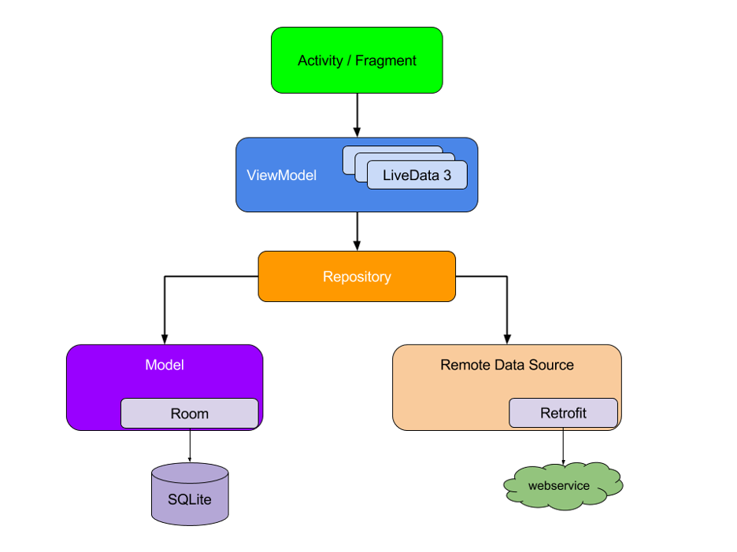

# SwipeNews Android Application   (Google Component Architectural MVVM Pattern)

A Tinder style Android application that allows users to browse news and swipe to save. 
 
News Source: https://newsapi.org/
 
 

## JetPack Navigation Component
* Utilized Android Material library to create a bottom navigation view with home, search and save buttons.
* Created three navigation fragments (home, search and save), and a navigation graph.

## Network with Retrofit
* Added three model classes (Source, Article and NewsResponse).
* Created NewsApi with retrofit (OkHttp, Gson) to get news responses.

## Gander/Stetho (Debugging/Logging Tool)
* Utilized these two tools to view network requests and local database content.

## Model-View-ViewModel (MVVM) and Repository
* Created a Repository as an intermediate container for providing data.
* Hided network requests behind the Repository.
* Built ViewModel classes and used LiveData to provide updates for the future UI views.

## Home Page Layout / UI Interaction Setup
* Implemented SwipePlaceHolderView to present news on the home page for users to swipe.
* Utilized View Binding to allow automatic binding UI layout resources with Java code.
* Imported Picasso image downloading and caching library to handle image request

## Search Page Implementation
* Used RecyclerView (Adapter, LayoutManager) to display a scrolling list of elements based on large data sets.
* Implemented the SpanSizeLookup for different grid size.
